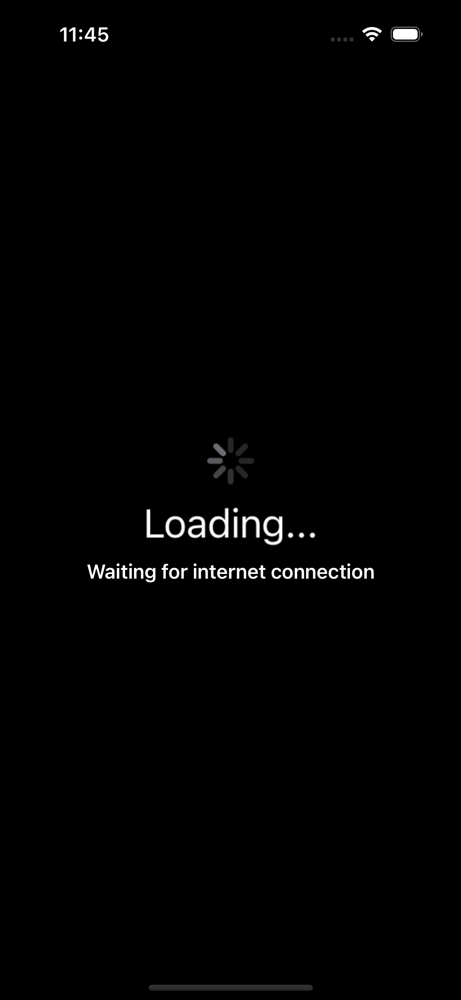

# Tribe

Tribe is an app that downloads an image from a static URL and displays it on the screen if the network call is successful.

> MVP is used as the guiding design pattern, with adaptations to support SwiftUI.

### AC 1
On app start, a loading screen is presented, showing a spinning wheel. The app supports dark mode.

### AC 2
If the internet is not accessible within half a second after displaying the loading screen, an additional text is displayed on the loading screen, indicating that there is currently no network connection.

While the loading screen is being displayed, an image download is performed in the background, with a timeout of 2 seconds. The network operation is performed with `Lotus`, a framework that uses `NetworkOperationPerformer` to perform async operations. It is integrated with the project via `SPM`.

- Lotus framework: https://github.com/viniciusml/Lotus

### AC 3
Once the image is downloaded, it is displayed on a second screen.

### AC 4
If the image has not been downloaded successfully, a text stating that the download failed should be displayed.

